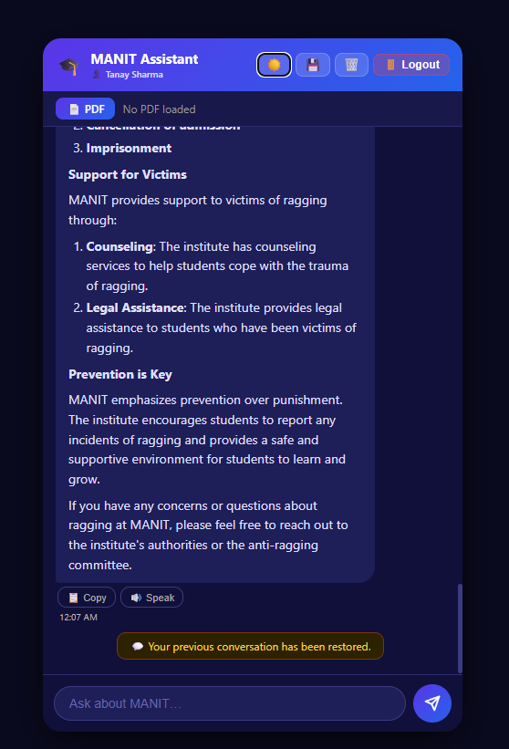

# 🎓 AI-Powered College Assistant Chatbot

> A fully functional AI chatbot built from scratch using HTML, CSS & JavaScript — powered by xAI's Grok and deployed on Vercel.


---

## 🌐 Live Demo

🔗 **[Click here to try the live chatbot →](https://manitbot.vercel.app)**

---

## 📌 About The Project

This is a minor academic project developed as part of the **BTech 2nd Year** curriculum at **Maulana Azad NAtional Institute of Technology Bhopal**.

The chatbot is designed to assist college students and staff by answering academic queries related to:
- Attendance rules and policies
- Exam schedules and guidelines
- CGPA and grading system
- College rules and regulations
- General academic FAQs

The bot is powered by **Grok-3-mini** from xAI, accessed securely through a serverless Vercel function so the API key is never exposed on the frontend.

---

## ✨ Features

| Feature | Description |
|---|---|
| ⌨️ Typing Animation | Bot replies appear letter by letter like a real chat |
| 🌙 Dark / Light Mode | Toggle between themes with a single click |
| 🕐 Message Timestamps | Every message shows the time it was sent |
| 📋 Copy Button | Copy any bot reply to clipboard instantly |
| 🔊 Text-to-Speech | Listen to bot replies using browser Speech API |
| 🧠 Conversation Memory | Bot remembers the full session for context-aware replies |
| 🔒 Secure API | API key stored as environment variable, never in frontend code |
| ☁️ Serverless Backend | Vercel function handles all Grok API communication |

---

## 🛠️ Tech Stack

```
Frontend   →  HTML5, CSS3, Vanilla JavaScript
Backend    →  Vercel Serverless Functions (Node.js)
AI Model   →  Grok-3-mini (xAI) via REST API
Hosting    →  Vercel (Free Tier)
```

---

## 📁 Project Structure

```
my-chatbot/
│
├── index.html          # Main chat UI
├── style.css           # Styling + dark mode
├── script.js           # Frontend logic (typing, TTS, memory, copy)
│
└── api/
    └── chat.js         # Vercel serverless function → talks to Claude API
```

---

## 🚀 How To Run Locally

### Prerequisites
- A free account on [console.x.ai](https://console.x.ai) to get your API key
- A free account on [vercel.com](https://vercel.com)
- [Node.js](https://nodejs.org) installed on your machine

### Steps

**1. Clone this repository**
```bash
git clone https://github.com/taanaysharma/my-chatbot-frontend.git
cd my-chatbot-frontend
```

**2. Install Vercel CLI**
```bash
npm install -g vercel
```

**3. Create a `.env` file in the root folder**
```
XAI_API_KEY=your_api_key_here
```

> ⚠️ Never commit your `.env` file. It is already added to `.gitignore`.

**4. Run locally**
```bash
vercel dev
```

**5. Open in browser**
```
http://localhost:3000
```

---

## ☁️ How To Deploy on Vercel

**1. Push your code to GitHub**
```bash
git add .
git commit -m "Initial commit"
git push origin main
```

**2. Import project on Vercel**
- Go to [vercel.com](https://vercel.com) → New Project → Import from GitHub

**3. Add Environment Variable**
- In Vercel project settings → Environment Variables
- Name: `XAI_API_KEY`
- Value: your key from [console.x.ai](https://console.x.ai)

**4. Click Deploy**
- Vercel gives you a live URL instantly ✅

---

## 🔑 How To Get Your Free Grok API Key

1. Go to **[console.x.ai](https://console.x.ai)**
2. Sign in with your X (Twitter) account
3. Click **API Keys → Create API Key**
4. Copy and paste it into Vercel environment variables

---

## 🔒 Security Notes

- The Grok API key is **never written in frontend code**
- It is stored as a **Vercel environment variable** (server-side only)
- The `/api/chat.js` serverless function acts as a secure middleware between the user and Grok
- No user data or chat history is stored anywhere — everything is session-only

---

## 📸 Screenshots

| Light Mode | Dark Mode |
|---|---|
|  |  |

---

## 🙋 Author

**Tanay Sharma**
- Roll No: 24112011186
- Branch: CSE
- College: MANIT, Bhopal
- GitHub: [@taanaysharma](https://github.com/taanaysharma)

---

## 👨‍🏫 Project Guide

**Prof. Vasudev Dehalwar**
Department of Computer Science and Engineering
Maulana Azad National Institute of Techonology, Bhopal

---

## 📄 License

This project is licensed under the [MIT License](LICENSE) — feel free to use and modify it for educational purposes.

---

> ⭐ If you found this project helpful, consider giving it a star on GitHub!
